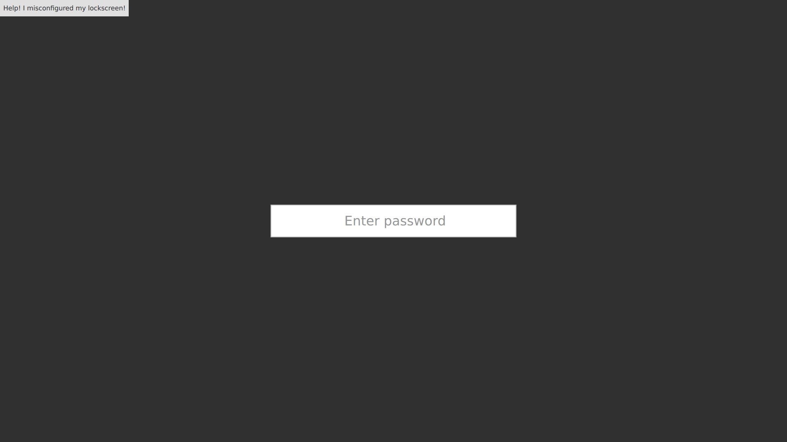

# Lockscreen

This is a barebones lockscreen with a password input box.
Note that you MUST have `pamtester` installed or you won't be able to log in.

You can run the lockscreen with `quickshell -p shell.qml`.

You can run the lockscreen in test mode (as a window) with `quickshell -p test.qml`.

