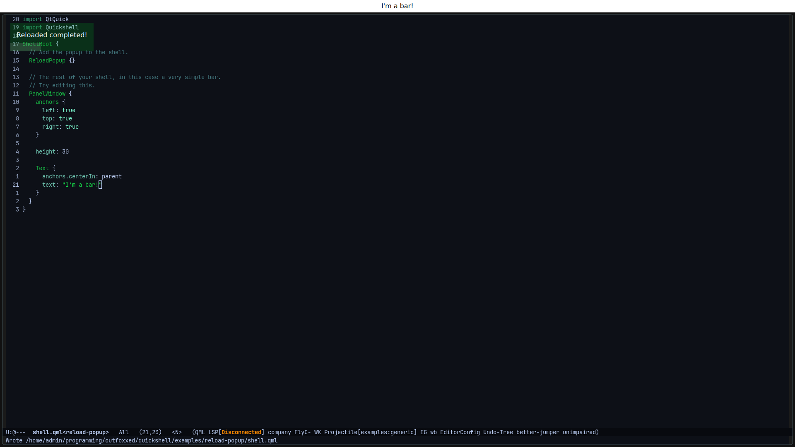
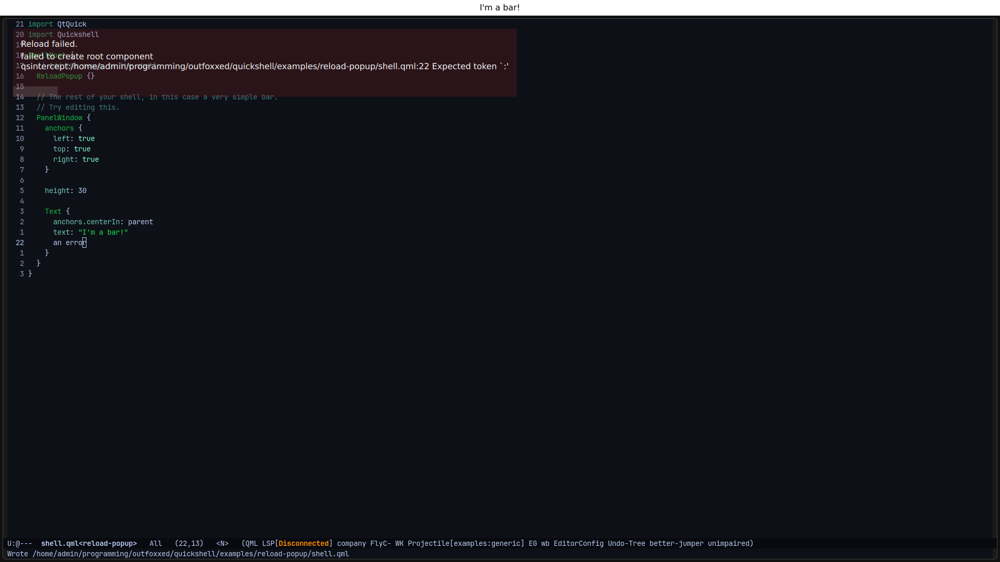

# Reload Popup

Replaces the standard quickshell config reload popup.

You can try it out by running `quickshell -p shell.qml` which will put a simple bar
on the screen. The popup will appear if the file is edited, and display the error
if the configuration is invalid.

After making a good edit:

After making a bad edit:

