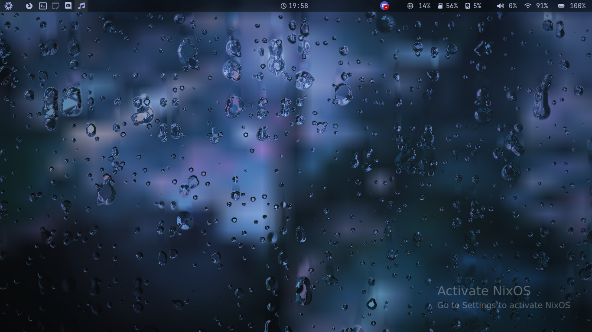

# Shader Wallpaper

This is an example of using Quickshell as a wallpaper, along with using shaders.

To commpile the shader, do `qsb --qt6 -o ./Raining.frag.qsb ./Raining.frag`

I got the shader from [Shadertoy](https://www.shadertoy.com/view/ltffzl). By default, it's not compatible with QSB, so I had to make the following changes:
- convert `void mainImage( out vec4 fragColor, in vec2 fragCoord )` to just `void main()`
- add the following to the top of the file (it was easier than renaming all the uses of the input variables):

```glsl
#version 440

layout(location = 0) in vec2 fragCoord; // this is gotten from the `default.vert`
layout(location = 0) out vec4 fragColor;

layout(binding = 1) uniform sampler2D source; // background image

layout(std140, binding = 0) uniform buf {
    mat4 qt_Matrix;
    float qt_Opacity;
    float time;
    vec2 resolution;
    vec2 sourceResolution;
} ubuf;

#define iTime ubuf.time
#define iResolution ubuf.resolution
#define iChannel0 source
// I don't want to deal with mouse input
#define iMouse vec3(0.0, 0.0, 0.0)
```

> [!NOTE]
> Not all shadertoy shaders are easily compatible with QSL. You might have to do extra modifications.


